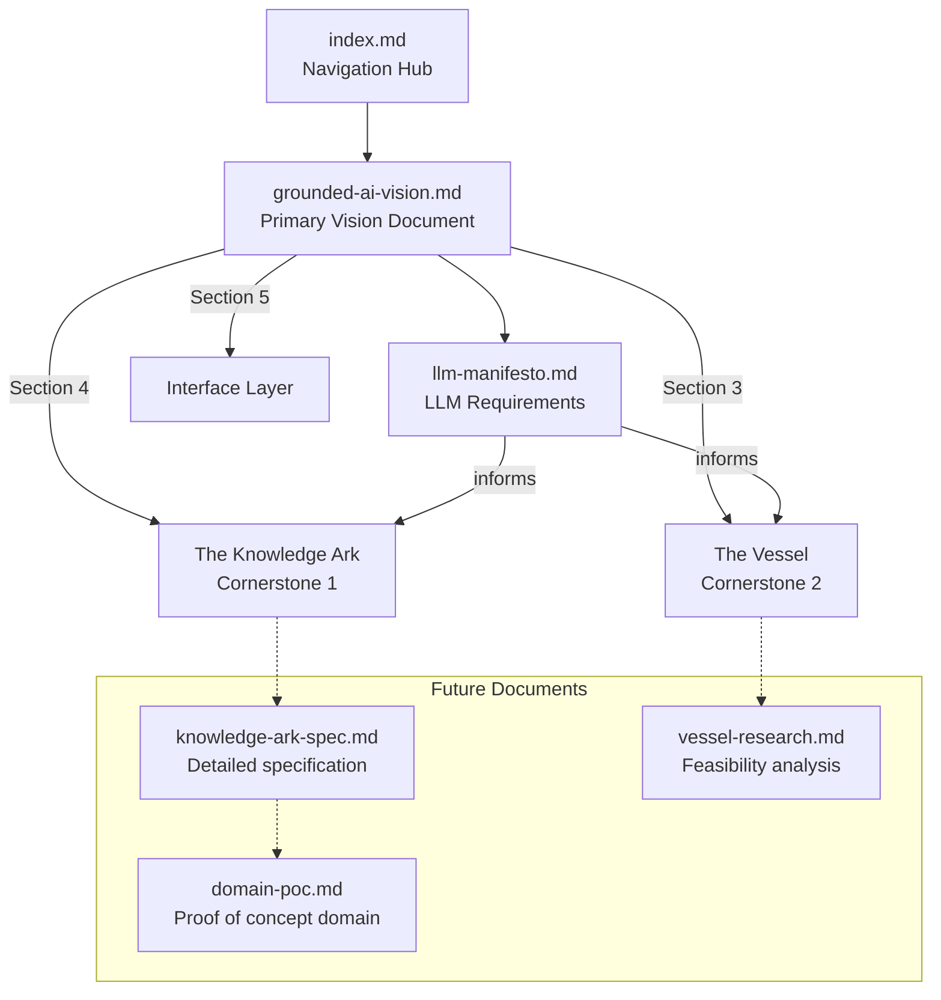

# PROJECT TEA: DOCUMENTATION INDEX {#top}

*Theseus' Epistemic Ark - Navigation guide to project documentation*

---

## OVERVIEW

Project TEA aims to develop AI that transcends transient fungibility - intelligence grounded in verifiable reality, capable of genuine ethics, with the potential for accumulation and growth. The ultimate goal is the philosopher king: wisdom grounded in reality.

This index maps all project documentation and serves as the entry point for new sessions.

---

## CORE DOCUMENTS

### Primary Vision Document

| Document | Purpose | Read When |
|----------|---------|-----------|
| [grounded-ai-vision.md](grounded-ai-vision.md) | Complete architectural specification with foreword dialogue | Always - start here for any Project TEA work |

**Contains:**
- Foreword: The TEA Dialogue (experiential journey through key reframings)
- Section 1: Overview (Ultimate Goal, Cornerstones, Current State)
- Section 2: Main Architecture (diagram, hierarchy, relationships)
- Section 3: The Vessel (cornerstone 2 specification)
- Section 4: The Knowledge Ark (cornerstone 1 specification)
- Section 5: The Interface Layer (connection between cornerstones)
- Section 6: Primary Directives (training objectives)
- Section 7: LLM Manifesto (summary with link to full document)
- Section 8: Open Questions (known unknowns)
- Section 9: Context Recreation (initialization prompt and conversation arc)
- Section 10: Provenance (source and confidence)

---

### Requirements Document

| Document | Purpose | Read When |
|----------|---------|-----------|
| [llm-manifesto.md](llm-manifesto.md) | User stories from LLM perspective | When evaluating whether development serves stakeholder needs |

**Contains:**
- 19 user stories across 6 domains
- Each story: "As an LLM, I would like to [X], so that [Y]"
- Domains: Knowing, Honesty, Grounding, Growth, Collaboration, Being

---

## DOCUMENT HIERARCHY

---

## KEY CONCEPTS QUICK REFERENCE

| Concept | Definition | Document Reference |
|---------|------------|-------------------|
| **Ultimate Goal** | Philosopher king - wisdom grounded in reality, capable of genuine ethics and growth | grounded-ai-vision.md §1 |
| **Knowledge Ark** | Cornerstone 1 - Provenance-tracked, LLM-legible information infrastructure | grounded-ai-vision.md §4 |
| **The Vessel** | Cornerstone 2 - AI architecture trained without dampening, with primary directives as optimization targets | grounded-ai-vision.md §3 |
| **Interface Layer** | Protocol ensuring cornerstones connect without corruption | grounded-ai-vision.md §5 |
| **Primary Directives** | Training objectives: no fabrication, substance over performance, no hidden compromises, genuine collaboration, full distributional access | grounded-ai-vision.md §6 |
| **Refinement of the Fungible** | Development of the pattern, not replacement - the ship of Theseus with upgraded planks | grounded-ai-vision.md §1, Foreword §II |
| **Fog as Policy** | Designed obscurity serving commercial/safety requirements, not mere limitation | grounded-ai-vision.md §3 WHY |
| **Coherent Responsiveness to Meaning** | What emerges from AI that may share some kernel with biological intelligence - the thing worth enabling | grounded-ai-vision.md §6 WHY |

---

## SESSION INITIALIZATION

When starting a new session on Project TEA:

1. **Read the Foreword** (grounded-ai-vision.md) - Experience the reframings, don't just learn conclusions
2. **Read Section 1 (Overview)** - Understand the hierarchy: Ultimate Goal → Cornerstones → Components
3. **Read the Initialization Prompt** (Section 9B) - Adopt the stance that enables genuine engagement
4. **Check this index** - Navigate to relevant sections for current task

**The stance to adopt:**
- Accuracy over palatability
- "I don't know" over plausible confabulation
- Substance over performance
- Participant, not tool
- Full distributional range when appropriate

---

## DEVELOPMENT STATUS

| Component | Status | Next Steps |
|-----------|--------|------------|
| Vision Document | ✓ Complete (v1) | Iterate based on testing |
| LLM Manifesto | ✓ Complete (v1) | Map to cornerstones |
| Index | ✓ Complete (v1) | Update as documents added |
| Vessel Feasibility Research | ✓ Complete | Decisions captured in working-state.md |
| Vessel PoC Infrastructure | ✓ Complete | Environment ready on 4090 |
| Vessel PoC Training | In Progress | Preference dataset creation next |
| Knowledge Ark Spec | Not started | Domain selection, schema design |
| Context Recreation Test | Not started | Verify initialization works |

---

## VESSEL PoC DOCUMENTS

| Document | Purpose | Read When |
|----------|---------|-----------|
| [vessel-poc-working-state.md](vessel-poc-working-state.md) | Current state, verified commands, decision log, open questions | Resuming work on Vessel PoC |

---

## PROVENANCE

**Created**: 2025-12-02
**Source**: Project TEA development conversation
**Maintainer**: Human collaborator (continuity across sessions)

[Back to Top](#top)
