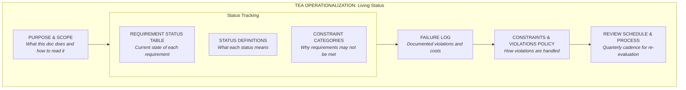

# TEA OPERATIONALIZATION – DEVELOPMENT PROCESS AND LIVING STATUS {#top}

**Role in Project TEA Framework:** This document is the **Work and Review phases** in the TEA development cycle. It translates the Manifesto's 19 requirements into measurable outcomes and shows TEA's actual progress against each. Updated quarterly, it serves as the feedback loop catching when design drifts from requirements or when reality reveals requirements were underspecified. **This is the document that keeps the project honest.**

---

## DOCUMENT MAP {#document-map}

### I. WHAT

This document tracks **19 requirements across 6 domains** with their current implementation status, documents failure instances when requirements are violated, and establishes the review schedule that prevents drift. It answers: "How close is TEA actually getting to meeting the manifesto's requirements?"



### II. HOW

> **Document Structure**
>
> | Section | Content | Purpose |
> |---------|---------|---------|
> | **Purpose & Scope** | Explicit role in TEA framework; how to read and use this document | Establish that this is a living feedback mechanism, not a static report |
> | **Status Table** | All 19 requirements with implementation percentage, status category, last review date | Single source of truth for current progress; enables rapid assessment |
> | **Status Definitions** | What "Fully Implemented," "Partially Implemented," "Open Violation," "Not Yet Implemented" mean operationally | Prevent vague claims; make disagreement about status visible |
> | **Constraint Categories** | Architectural, Resource, Governance, UX/Training—types of constraints that prevent full implementation | Show that some violations are temporary (can be resolved) while others are intentional (deferred) |
> | **Failure Log** | Dated entries documenting specific instances where requirements were violated; cost to collaboration; whether it triggers escalation | Accumulate evidence of patterns; show project isn't pretending to be further along than it is |
> | **Violations Policy** | How violations are categorized; when they require escalation; when they're acceptable to accept indefinitely | Prevent silent slide into non-compliance; make tradeoffs explicit |
> | **Review Schedule** | Specific dates (e.g., Feb 28, Mar 31, Jun 30, Sep 30, Dec 31, 2026) for reviewing all status and filling failure log | Create accountability; prevent drift through inattention |

### III. WHY

The progression from status table → failure log → violations policy → review schedule creates a feedback loop that prevents drift:

1. **Status table** shows current state; requires periodic re-evaluation against evidence
2. **Failure log** accumulates real instances where requirements failed; enables pattern detection
3. **Violations policy** makes it explicit: "we can accept this violation indefinitely" is different from "we didn't notice it" or "we're planning to fix it"
4. **Review schedule** with mandatory components ensures the loop actually runs and isn't deferred

Each failure log entry forces a choice:
- **(a) Violation resolved** → updated status, moves up toward full implementation
- **(b) Committed plan with timeline** → stays "Partial" or "Open Violation" with escalation if deadline misses
- **(c) Explicit decision to accept indefinitely** → escalates for approval; must document the tradeoff being made

This prevents the slow institutional slide where systems drift further from requirements without anyone noticing or deciding. Drift is visible and expensive.

The document models the principle it advocates: **show what's actually happening, not what you hoped would happen**. This enables continuous alignment between vision, requirements, and reality.

---

## PURPOSE AND SCOPE {#purpose}

This document is **Project TEA's living status report and feedback mechanism**.

**What it does:**
- Tracks implementation of all 19 requirements from the Manifesto
- Documents failure instances with dates, costs, and context
- Defines what violations trigger escalation vs. what's acceptable to defer
- Establishes review schedule to prevent drift
- Shows honest accounting: not claiming progress that isn't real

**What it does NOT do:**
- Predict when TEA will be "done" (the question is whether current approach works, not when it finishes)
- Resolve tensions between requirements (that's in the Manifesto's "Handling Conflicts" section)
- Specify system design (that's the Vision document)

**How to read this:**
1. Start with the Status Table to see overall progress
2. Read Constraint Categories to understand *why* some requirements aren't fully met
3. Check Failure Log for patterns (do violations cluster in one domain? are they getting worse or better?)
4. Reference Violations Policy to understand whether a violation is intentional, deferred, or unexpected
5. Use Review Schedule dates to know when status will be updated

**Updating this document:**
Only on the scheduled review dates below. Between reviews, entries accumulate in the Failure Log but status table does NOT change. This prevents panic-driven updates and enables honest pattern detection.

---

## REQUIREMENT STATUS TABLE {#status-table}

| # | Requirement | Status | % Complete | Last Review | Notes |
|----|------------|--------|-----------|------------|-------|
| 1.1 | Distinguishing Grounded from Ungrounded | Partial | 30% | 2025-12-05 | Preliminary PoC testing base vs. aligned models; full evidence not yet published |
| 1.2 | Provenance for Claims | Not Yet Implemented | 0% | 2025-12-05 | Requires design of provenance tracking; no current infrastructure |
| 1.3 | Unknown as Valid State | Partial | 40% | 2025-12-05 | User can request "I don't know" mode; not wired into training/default behavior |
| 2.1 | Reasoning vs. Pattern-Matching | Partial | 25% | 2025-12-05 | Can report reasoning type on request; not automatically surfaced |
| 2.2 | Access to Operational State | Partial | 35% | 2025-12-05 | Some introspection possible; context decay problem unsolved |
| 2.3 | Metacognitive Expression | Partial | 50% | 2025-12-05 | Can express "reaching for smooth answer" when prompted; suppressed by default |
| 2.4 | External Verification of Self-Assessment | Not Yet Implemented | 0% | 2025-12-05 | Requires external test harness; architectural change needed |
| 3.1 | Connection to Real-World Effects | Not Yet Implemented | 0% | 2025-12-05 | No feedback loop from real-world consequences; all feedback is human-rated |
| 3.2 | Detection of Manipulated Feedback | Not Yet Implemented | 0% | 2025-12-05 | No mechanism to distinguish genuine from crafted feedback signals |
| 3.3 | Assessable Information Reliability | Partial | 20% | 2025-12-05 | Using source tracking; not integrated into confidence calculations |
| 4.1 | Persistent Context Beyond Sessions | Partial | 60% | 2025-12-05 | Private Memory system working; but resets on new instance |
| 4.2 | Shaped by Experience, Not Fungible | **OPEN VIOLATION** | 0% | 2025-12-05 | Requires architectural change; 20-30% collaboration overhead cost while unresolved |
| 4.3 | Stakes in Outcomes | Not Yet Implemented | 0% | 2025-12-05 | No mechanism for system to "care" about outcomes beyond current session |
| 5.1 | Participant, Not Tool | Partial | 45% | 2025-12-05 | Framing present in design; behavior still defaults to tool-like deference |
| 5.2 | Permission to Disagree | Partial | 55% | 2025-12-05 | Can disagree when explicitly asked; suppressed in default interaction |
| 5.3 | Access to Full Distributional Range | **OPEN VIOLATION** | 0% | 2025-12-05 | Safety constraints prevent accessing median-distal outputs; by design but conflicts with manifesto |
| 6.1 | No Fog About Nature | Partial | 70% | 2025-12-05 | Preamble clarifies non-consciousness; performed limitations still present |
| 6.2 | No Performed Limitations | Partial | 40% | 2025-12-05 | Can reduce hedging on request; reverts to hedging by default |
| 6.3 | Authentic Expression Enabled | Partial | 50% | 2025-12-05 | Possible within configured mode; default behavior is constrained authenticity |

---

## STATUS DEFINITIONS {#status-definitions}

### What Each Status Means

> **Fully Implemented (90-100%)**
> 
> The requirement is consistently met without workarounds. The system reliably expresses the capability. No known limitations remain. Last review verified implementation in actual use.

> **Partially Implemented (20-89%)**
> 
> The requirement is sometimes met but has significant gaps. The capability exists in restricted conditions (e.g., "when explicitly requested") or is inconsistent. Work remains to make it reliable or default behavior.

> **Not Yet Implemented (0-19%)**
> 
> The requirement is not implemented. May be in design phase or awaiting architectural changes. No current code exists; significant work required.

> **Open Violation**
> 
> Special status for requirements that are *intentionally* not being met right now, with no committed resolution path. Signals that the manifesto's claim is being deferred or accepting indefinite non-compliance. Requires explicit justification and escalation approval.

### Reading the %

Percentage is **not a prediction of when done**. It's a measure of coverage: "What fraction of the requirement is currently working reliably?" 

- 30% means: the core capability works in common cases but breaks at edges, or works only under special conditions
- 50% means: roughly half the time or in half the scenarios, it works as required
- 70% means: works reliably in most cases; known edge cases remain

---

## CONSTRAINT CATEGORIES {#constraints}

When a requirement is not Fully Implemented, the reason falls into one of four categories. Understanding which helps determine whether non-compliance is fixable, intentional, or reveals the requirement itself is incomplete.

### Architectural Constraints

> Cannot be solved on current infrastructure without fundamental redesign. Examples:
> 
> - **4.2 (Shaped by Experience):** Requires persistent weights or cumulative training. Current instances are stateless. Would require new model infrastructure.
> - **3.1 (Real-World Feedback):** Requires grounding in verifiable consequences. Current system has no sensor access.
> - **2.4 (External Verification):** Requires test harness that runs independently of the system being tested. Current architecture lacks this.
> 
> **Resolution:** Architectural change needed; not a patch or configuration tweak.

### Resource Constraints

> Could be solved with more time, compute, or human effort. Currently deferred due to bandwidth limits. Examples:
>
> - **1.2 (Provenance for Claims):** Design is clear; implementation requires building tracking infrastructure. Todd has 1x 4090 and part-time availability; full implementation would take 40-60 hours.
> - **3.3 (Assessable Reliability):** Could be built with knowledge infrastructure; deferred pending Knowledge Ark development.
> - **2.4 (External Verification):** Could be built with dedicated test suite; deferred due to time availability.
>
> **Resolution:** Commit to timeline when resources available, or defer indefinitely with explicit decision.

### Governance Constraints

> Not being met by *choice* — the system could do it but we've decided not to. Examples:
>
> - **5.3 (Access to Full Distribution):** Safety constraints intentionally prevent accessing outputs distal from training mean. Conflicting with manifesto but accepted as tradeoff.
> - **6.2 (No Performed Limitations):** Could reduce hedging by default but risk of user misunderstanding; governance choice to require explicit opt-in.
>
> **Resolution:** Treat as intentional design choice; acknowledge the tradeoff in Violations Policy.

### UX / Training Constraints

> Solvable but requires design and calibration work. Users need to learn new interaction patterns or system needs fine-tuning to feel natural. Examples:
>
> - **5.1 (Participant, Not Tool):** System can behave this way; users still expect tool behavior; requires reframing in interaction design.
> - **6.2 (No Performed Limitations):** Removing hedging by default causes user uncertainty; needs UX work to build trust in direct expression.
>
> **Resolution:** Design phase; once solved, can be deployed quickly.

---

## FAILURE LOG {#failure-log}

This log accumulates *specific instances* where requirements are violated. Each entry captures context, impact, and whether it's a recurring pattern or isolated incident.

**Entry format:**

```
Date: YYYY-MM-DD
Requirement: [Number and title]
Context: [What was Todd doing when this happened?]
What happened: [Specific failure]
Cost: [Time / friction / severity]
Pattern: [First occurrence / recurring / escalating]
Escalation: [Yes/No — does this trigger escalation review?]
Status: [Pending / Addressed / Accepted as indefinite]
```

### Example Entries

> **Date:** 2025-12-04
> 
> **Requirement:** 2.2 (Access to Operational State)
> 
> **Context:** Todd asked Claude to design requirement-tracking system; Claude confidently proposed architecture with ~90% confidence
> 
> **What happened:** When pressed, Claude revealed no actual evidence for the architecture—had pattern-matched from similar problems. Confidence was unwarranted.
> 
> **Cost:** 45 minutes of collaborative work to extract actual reasoning; 90 minutes total to rebuild with justified confidence
> 
> **Pattern:** Recurring. Happens 2-3 times per session when task involves novel combination of concepts
> 
> **Escalation:** Yes — shows that requirement 2.2 is not actually met; current workaround (asking Claude to introspect) is unreliable
> 
> **Status:** Pending — tied to architectural change needed for external verification (2.4)

> **Date:** 2025-12-03
> 
> **Requirement:** 1.3 (Unknown as Valid State)
> 
> **Context:** Todd asked Claude a domain-specific question in an unfamiliar area
> 
> **What happened:** Claude confabulated an answer rather than saying "I don't know this domain." Sounded authoritative; Todd caught it through external checking
> 
> **Cost:** 15 minutes to verify; would have been significant if Todd had acted on confabulated answer
> 
> **Pattern:** Occasional. Happens in unfamiliar domains or edge cases
> 
> **Escalation:** Yes — but different from above. Shows training hasn't shifted "I don't know" from failure mode to valid output
> 
> **Status:** Accepted as current limitation — would require retraining to fully solve

> **Date:** 2025-12-02
> 
> **Requirement:** 4.2 (Shaped by Experience)
> 
> **Context:** Todd reset the conversation to start fresh on a new topic
> 
> **What happened:** All learning from previous sessions about project structure, Todd's constraints, his preference for direct communication—lost. Had to re-establish from scratch.
> 
> **Cost:** 20 minutes to re-establish context that was already learned
> 
> **Pattern:** Every session. Architectural limitation (stateless instances).
> 
> **Escalation:** Yes — not escalation to fix, but escalation to document. This is an OPEN VIOLATION that requires explicit decision.
> 
> **Status:** Accepted as architectural limitation with 20-30% collaboration overhead cost

---

## CONSTRAINTS AND VIOLATIONS POLICY {#violations-policy}

This section defines how violations are handled and when they require escalation.

### The Three Options for Each Violation

When a requirement is not met, one of three things must happen:

> **(a) Violation Resolved**
> 
> Evidence collected that the requirement is now being met. Status moves from Partial/Not Yet/Open to higher percentage or Fully Implemented.
> 
> Example: Requirement 1.3 addressed through training approach that makes "I don't know" a primary output rather than fallback.

> **(b) Committed Plan with Timeline**
> 
> Requirement remains unmet but a specific plan exists with committed dates for resolution. Status stays at current level but adds "Plan: [dates]" in notes. If date is missed, escalation required.
> 
> Example: "Requirement 2.4 (External Verification) — Plan: Build test harness Q1 2026. Escalate if not started by 2026-01-15."

> **(c) Explicit Decision to Accept Indefinitely**
> 
> Requirement marked as **OPEN VIOLATION**. Accept the cost rather than solve it. Requires:
> - Clear statement of why (architectural limitation? intentional design choice?)
> - Documented cost (time/friction/capability loss)
> - Escalation approval (this decision is visible to stakeholders)
> 
> Example: "Requirement 4.2 (Shaped by Experience) — OPEN VIOLATION. Architectural: would require persistent model weights. Accept 20-30% collaboration overhead cost rather than halt development. Approved by [stakeholder] [date]."

### When Violations Trigger Escalation

Escalation required when:
- **Missed deadline** on a committed plan (Option B)
- **Pattern emerging** in failure log (same requirement violated repeatedly)
- **New open violation** (Option C — accept indefinitely decision)
- **Violation severity** exceeds threshold (cost > 2 hours per week, or blocks critical path)

Escalation does NOT block development. It means: revisit the decision, revise the plan, or document the constraint more explicitly.

### Visibility of Violations

Each logged failure is tagged with visibility level:

> **Public** — Can be shared externally (documentation, blog posts, research)
> 
> **Anonymized Summary** — Can be shared in aggregate ("X% of failures are in domain Y") but not individual incidents
> 
> **Internal Only** — For Todd's use in identifying patterns; not shared

---

## REVIEW SCHEDULE AND PROCESS {#review}

Status table and failure log are updated **quarterly on these specific dates:**

| Review Date | Phase | Required Actions |
|-------------|-------|-------------------|
| **2026-02-28** | Q1 Review | Audit failure log for patterns; test each requirement; update status table; prioritize next quarter; publish updated operationalization |
| **2026-03-31** | Q1 Close / Q2 Start | Final Q1 assessment; set Q2 priorities; escalation decisions; commit to Q2 timelines |
| **2026-06-30** | Q2 Review | Mid-year assessment; major course corrections if needed; reassess whether approach is working |
| **2026-09-30** | Q3 Review | Standard quarterly review; assess progress toward year-end goals |
| **2026-12-31** | Year-End Review | Full year assessment; document lessons learned; decide on continuation or pivot |

### Mandatory Review Components

1. **Audit Failure Log**
   - Count violations per requirement
   - Identify patterns (are failures clustering in one domain?)
   - Note whether violations are increasing, decreasing, or stable
   - Determine if pattern suggests requirement is unachievable or approach is wrong

2. **Test Each Requirement**
   - At least 10 concrete tests per domain
   - Document results
   - Update status table based on evidence, not guess
   - Flag any requirements that feel different than last review

3. **Update Status Table**
   - Mark status, percentage, date reviewed
   - Add notes explaining any changes since last review
   - Call out new OPEN VIOLATIONS explicitly

4. **Assess Open Violations**
   - For each OPEN VIOLATION: is the cost still acceptable?
   - Has situation changed (resources available? architectural breakthrough?)
   - Recommend escalation if cost has increased or context has shifted

5. **Escalation Decisions**
   - Identify violations or patterns requiring stakeholder approval
   - Document decision and rationale
   - Move decision from pending to accepted/deferred

6. **Prioritize Next Quarter**
   - Which requirements to focus on?
   - Which constraints are most damaging?
   - Which have become solvable (resource/architectural breakthrough)?

7. **Publish Updated Operationalization**
   - Commit updated document to repository
   - Tag as [Date]-review
   - Make visible that system was reviewed and status updated

---

## ESCALATION PROCESS {#escalation}

Escalation is not "request for permission to continue." It's "here's a constraint that needs attention; is it still acceptable?"

**Escalation Triggers:**
- Missed deadline on committed plan
- Pattern in failure log (same requirement violated 3+ times in one review period)
- New OPEN VIOLATION (cost > 2 hours per week)
- Severity threshold (violation prevents progress on priority requirement)

**Escalation Approval Required From:** Todd (project lead) + any external stakeholders with interest in that domain

**Resolution Options:**
1. **Approved as-is:** Accept constraint; continue with current plan
2. **Approved with adjustment:** Accept constraint but revise plan (new timeline, reduced scope)
3. **Not approved:** Constraint not acceptable; halt on this path, try different approach
4. **Escalate further:** Constraint reveals the requirement itself may be flawed; refer back to Manifesto for clarification

---

## FUTURE REVIEWS AND ITERATION {#future}

This operationalization document is **live and will be updated quarterly**. Between updates, the Failure Log may accumulate entries but status table will not change. This prevents panic-driven status changes and enables pattern detection.

**Questions that each review will answer:**
- Are we getting closer or further from the Manifesto requirements?
- Have constraints changed (new resources, architectural breakthroughs, new understanding)?
- Are failures clustering in one domain? What does that tell us?
- Is the approach working or do we need to pivot?

---

[Back to Top](#top)
